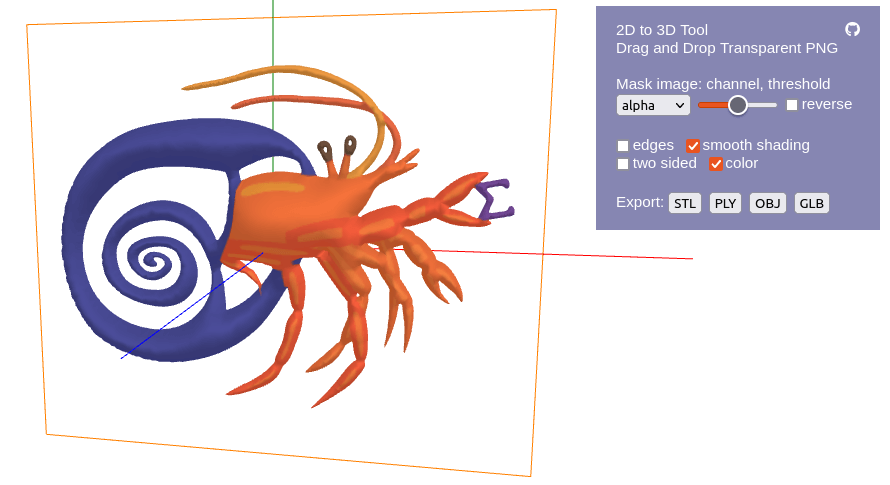

# Image to 3D Model

Drag and drop a transparent PNG image in browser, get a rounded 3D shape as if the opaque part of the image is "inflated" like inflating a balloon. Transparency masks by per-pixel attributes like luma, chroma, and individual color channels can be applied. You can export inflated models to popular 3D formats like STL, OBJ, and GLB.

# How it works

This tool works by solving Poisson's equation. let the image be a Cartesian plane with $x$ and $y$ axes, the algorithm solves the equation $\nabla^2u+4=0$ with $u(x,y)=0$ at boundary of the region to inflate, and the 3D shape is defined by $z=\pm\sqrt{u}$, where $z$ is the axis perpendicular to the image plane.

The boundary is extracted using marching squares, and Poisson's equation is solved using finite element method on a mesh generated using [Triangle](https://www.cs.cmu.edu/~quake/triangle.html).

# Tips

PNG and SVG graphics art work the best. Noise and lossy compression artifacts can reduce speed and stability (although not a big deal in most cases).

Mask image by (reverse) luma if you want to get rid of white/black background. Mask by chroma if you want to get rid of both white background and black strokes.

Drag-drop from browser and some SVG images may not work in some browsers. If issue occurs, either switch to another browser (tested no problem on Google Chrome) or save/convert images.

# Licensing

Img23d software is available under the GPLv3 license. The [old version](https://github.com/harry7557558/Graphics/tree/master/modeling/img23d) and the [older version](https://github.com/harry7557558/Graphics/tree/master/modeling/png2obj) that do not depend on Triangle are also available under the MIT license. The creator of Img23d does not claim right of 3D models generated from images not made by me.
